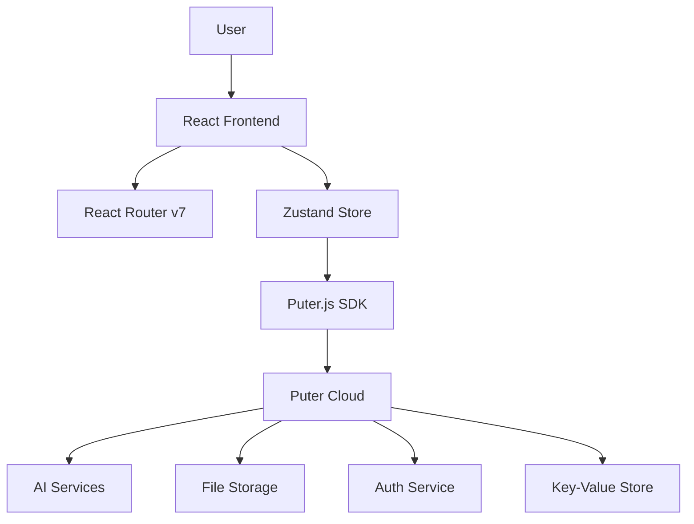

<div align="center">
  <br />
  
  <br />

  <div>
    
    
    
    
    
    
  </div>

  <h1 align="center">🤖 AI Resume Analyzer</h1>
  <p align="center">
    <strong>Smart AI-powered resume analysis with job matching and performance tracking</strong>
  </p>
  
  <p align="center">
    <a href="#features">✨ Features</a> •
    <a href="#quick-start">🚀 Quick Start</a> •
    <a href="#tech-stack">⚙️ Tech Stack</a> •
    <a href="#documentation">📚 Docs</a> •
    <a href="#contributing">🤝 Contributing</a>
  </p>
</div>

## 📋 <a name="table">Table of Contents</a>

1. ✨ [Introduction](#introduction)
2. ⚙️ [Tech Stack](#tech-stack)
3. 🔋 [Features](#features)
4. 🤸 [Quick Start](#quick-start)
5. 🔗 [Assets](#links)
6. 🚀 [More](#more)

## 🚀 About

## <a name="introduction">✨ Introduction</a>

AI Resume Analyzer is a comprehensive web application that transforms the job search process through intelligent resume optimization. Built with cutting-edge technologies, it provides job seekers with AI-powered insights, job matching capabilities, and performance analytics to maximize their career success.

### 🎯 **What It Does**

Transform your job search with:
- **AI-Powered Analysis**: Get detailed feedback across 5 key categories (ATS, Content, Skills, Structure, Tone)
- **Smart Job Matching**: Compare your resume against real job postings with compatibility scores
- **Performance Tracking**: Monitor improvements over time with comprehensive analytics
- **Personalized Recommendations**: Receive specific, actionable advice to improve your resume

### 🌟 **Why It's Special**

- **No Backend Required**: Powered entirely by Puter.js cloud services
- **Enterprise-Grade AI**: Uses Claude and GPT models for analysis
- **Real-Time Processing**: Instant feedback and analysis
- **Comprehensive Analytics**: Track performance across multiple resumes and job applications
- **Modern Architecture**: Built with React 19, React Router v7, and TypeScript

## <a name="tech-stack">⚙️ Tech Stack</a>

- **[React](https://react.dev/)** is a popular open‑source JavaScript library for building user interfaces using reusable components and a virtual DOM, enabling efficient, dynamic single-page and native apps.

- **[React Router v7](https://reactrouter.com/)** is the go‑to routing library for React apps, offering nested routes, data loaders/actions, error boundaries, code splitting, and SSR support—all with a smooth upgrade path from v6.

- **[Puter.com](https://jsm.dev/resumind-puter)** is an advanced, open-source internet operating system designed to be feature-rich, exceptionally fast, and highly extensible. Puter can be used as: A privacy-first personal cloud to keep all your files, apps, and games in one secure place, accessible from anywhere at any time.

- **[Puter.js](https://jsm.dev/resumind-puterjs)** is a tiny client‑side SDK that adds serverless auth, storage, database, and AI (GPT, Claude, DALL·E, OCR…) straight into your browser app—no backend needed and costs borne by users.

- **[Tailwind CSS](https://tailwindcss.com/)** is a utility-first CSS framework that allows developers to design custom user interfaces by applying low-level utility classes directly in HTML, streamlining the design process.

- **[TypeScript](https://www.typescriptlang.org/)** is a superset of JavaScript that adds static typing, providing better tooling, code quality, and error detection for developers, making it ideal for building large-scale applications.

- **[Vite](https://vite.dev/)** is a fast build tool and dev server using native ES modules for instant startup, hot‑module replacement, and Rollup‑powered production builds—perfect for modern web development.

- **[Zustand](https://github.com/pmndrs/zustand)** is a minimal, hook-based state management library for React. It lets you manage global state with zero boilerplate, no context providers, and excellent performance through selective state subscriptions.

## <a name="features">🔋 Features</a>

### 📊 **AI-Powered Resume Analysis**
- **5-Category Scoring**: ATS compatibility, content quality, tone & style, structure, and skills assessment
- **Detailed Feedback**: Specific tips and recommendations for each category
- **Smart Prompting**: Advanced AI prompts for accurate, actionable insights
- **Fallback Systems**: Reliable feedback even when AI services are unavailable

### 🎯 **Job Matching Dashboard**
- **Real Job Postings**: 5 sample jobs from top tech companies (Google, Microsoft, Apple, Amazon, Netflix)
- **Compatibility Scoring**: Skills match, experience fit, keyword analysis, and overall compatibility
- **Visual Indicators**: Color-coded skills (matching vs. missing)
- **Detailed Breakdowns**: Comprehensive match analysis with improvement recommendations

### 📈 **Performance Analytics**
- **Resume Comparison**: Side-by-side comparison of up to 3 resumes
- **Trend Tracking**: Monitor improvement trends over time
- **Portfolio Analytics**: Overall performance metrics across all resumes
- **Best Performer Identification**: Automatically identify top-performing resumes
- **Insights Generation**: AI-powered recommendations based on performance data

### 🔐 **Secure Authentication & Storage**
- **Browser-Based Auth**: Seamless authentication with Puter.js (no backend setup required)
- **Cloud Storage**: Secure file storage and retrieval
- **Data Persistence**: Resume data and analytics stored reliably
- **User Profiles**: Personalized experience with user-specific data

### 🎨 **Modern UI/UX**
- **Responsive Design**: Optimized for desktop, tablet, and mobile devices
- **Loading States**: Skeleton loaders and smooth transitions
- **Error Handling**: Comprehensive error boundaries and user feedback
- **Accessibility**: Built with accessibility best practices
- **Performance**: Optimized bundle splitting and lazy loading

### 🛠️ **Developer Experience**
- **TypeScript**: Full type safety throughout the application
- **Testing Suite**: Comprehensive tests with Vitest and Testing Library
- **Performance Monitoring**: Bundle analysis and optimization tools
- **Documentation**: Extensive documentation and code comments
- **Modern Tooling**: Vite, React Router v7, and latest React features

## <a name="quick-start">🤸 Quick Start</a>

Follow these steps to set up the project locally on your machine.

**Prerequisites**

Make sure you have the following installed on your machine:

- [Git](https://git-scm.com/)
- [Node.js](https://nodejs.org/en)
- [npm](https://www.npmjs.com/) (Node Package Manager)

**Cloning the Repository**

```bash
git clone https://github.com/adrianhajdin/ai-resume-analyzer.git
cd ai-resume-analyzer
```

**Installation**

Install the project dependencies using npm:

```bash
npm install
```

**Running the Project**

```bash
npm run dev
```

Open [http://localhost:5173](http://localhost:5173) in your browser to view the project.

## <a name="links">🔗 Assets</a>

Project assets are included in the `public` directory.

## <a name="documentation">📚 Documentation</a>

For detailed documentation, please refer to:

- **[Development Guide](DEVELOPMENT.md)** - Comprehensive development documentation
- **[API Reference](DEVELOPMENT.md#api-reference)** - Complete API documentation  
- **[Testing Guide](DEVELOPMENT.md#testing)** - How to run and write tests
- **[Performance Guide](DEVELOPMENT.md#performance)** - Optimization and monitoring
- **[Deployment Guide](DEVELOPMENT.md#deployment)** - Production deployment options

### Architecture Overview



### Key Technologies

| Component | Technology | Purpose |
|-----------|------------|----------|
| **Frontend** | React 19 + TypeScript | Modern UI with type safety |
| **Routing** | React Router v7 | Full-stack routing with SSR |
| **Styling** | Tailwind CSS v4 | Utility-first styling |
| **State** | Zustand | Lightweight state management |
| **Backend** | Puter.js | Cloud services (auth, storage, AI) |
| **Testing** | Vitest + Testing Library | Comprehensive test coverage |
| **Build** | Vite | Fast development and builds |

## <a name="contributing">🤝 Contributing</a>

We welcome contributions! Here's how you can help:

### Ways to Contribute

- 🐛 **Report bugs** by opening issues
- 🎆 **Request features** or enhancements  
- 📝 **Improve documentation**
- 💻 **Submit code improvements**
- ✨ **Add new features**

### Development Process

1. **Fork** the repository
2. **Create** a feature branch: `git checkout -b feature/amazing-feature`
3. **Install** dependencies: `npm install`
4. **Make** your changes
5. **Test** your changes: `npm run test`
6. **Check** types: `npm run typecheck` 
7. **Commit** your changes: `git commit -m 'feat: add amazing feature'`
8. **Push** to your branch: `git push origin feature/amazing-feature`
9. **Open** a Pull Request

### Code Standards

- **TypeScript**: Strict mode enabled
- **Testing**: Write tests for new features
- **Documentation**: Update docs for API changes
- **Commits**: Follow conventional commit format
- **Code Style**: Consistent with existing patterns

### Getting Help

- 💬 **Discussions**: For questions and ideas
- 🐛 **Issues**: For bugs and feature requests
- 📚 **Documentation**: Check DEVELOPMENT.md first

## <a name="roadmap">🗺️ Roadmap</a>

### Completed ✅
- [x] AI-powered resume analysis
- [x] Job matching dashboard
- [x] Performance analytics
- [x] Authentication system
- [x] Responsive UI/UX
- [x] Testing framework
- [x] Performance optimization

### Planned 📦
- [ ] Email notifications for analysis completion
- [ ] Resume templates and suggestions
- [ ] Integration with job boards (LinkedIn, Indeed)
- [ ] Advanced analytics and insights
- [ ] Mobile app version
- [ ] Team/enterprise features

## <a name="license">📝 License</a>

This project is open source and available under the [MIT License](LICENSE).

---

<div align="center">
  <p><strong>Made with ❤️ and cutting-edge tech</strong></p>
  <p>
    <a href="https://github.com/yourusername/ai-resume-analyzer/stargazers">🌟 Star this repo</a> • 
    <a href="https://github.com/yourusername/ai-resume-analyzer/issues">🐛 Report issues</a> • 
    <a href="https://github.com/yourusername/ai-resume-analyzer/fork">🍴 Fork & contribute</a>
  </p>
</div>
